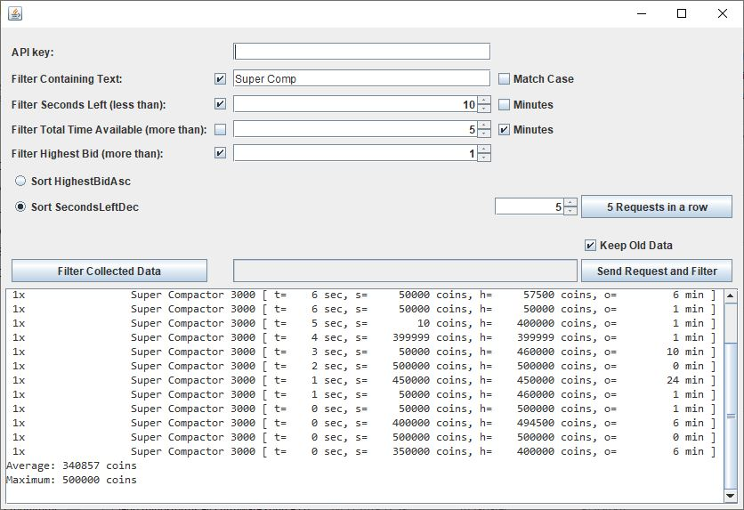

# HypixelSkyBlockAuctionsAnalyzer (HySbAa)
This is few-hours-project to create something that can tell the average price of an auction item
from the auction house on Hypixel Skyblock. 
Not one of my most beautiful projects but it is working well for the little time i had for it, so there you go.
There are visual bugs like it doesn't always scroll down, 
~the apikey isn't saved anywhere unless you hardcode yours in,~
not all the input values are clear what they do
and there isn't even a gradle build.

In brief: this is a fast coded, uncommented mess, but in the core it works and that was the only goal for this project.

To run this you just have to clone this project and import it into Eclipse as a normal Java Project.

Next you have to input your API key from hypixel (because I'm not allowed to share mine) into the APIKey.java
This is only necessary if you don't want to insert that key everytime you launch the program.

Now you can start the application.

Instert your api key if you haven't already.
Insert an item name you want to filter the auctions with and hit the Request button.
You can also hit the 5 request button which makes 5 timed requests to collect more data, 
but with a delay so you don't exceed the request limit (120 per minute) for your api key.
This may take a while because it does about 30 requests (all auction pages) 
and after that it waits 60 seconds to send the next request.

Finally you will get a detailed view of wich items have gotten sold in the last couple of minutes,
including an average and a max value at the bottom.

screenshot (a little bit outdated, but still shows most of the features)

